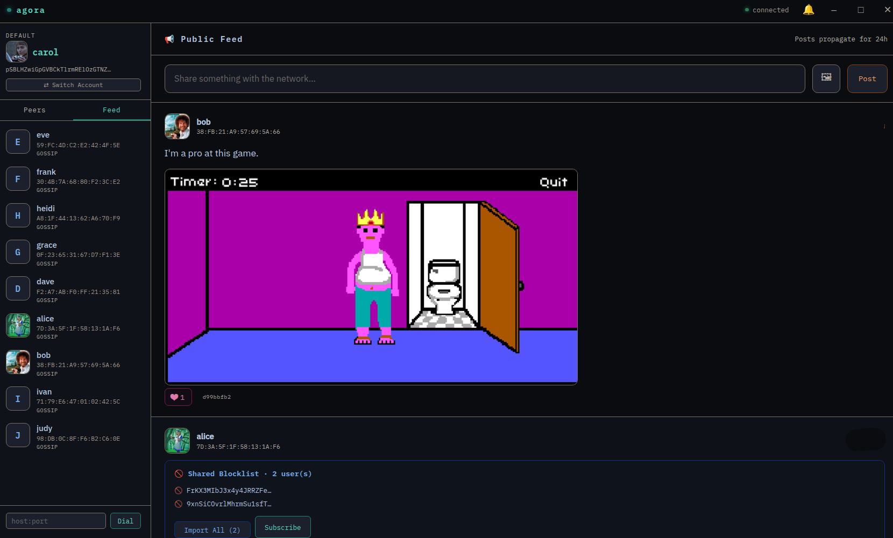

# Agora

**A decentralized platform for free speech.**

Agora is a peer-to-peer social network with no central servers, no moderators, no
corporate gatekeepers, and no kill switch. Identities are cryptographic, messages
and posts are carried across a DHT-based overlay, and every participant runs the
full stack themselves. Nobody can ban you, shadow-ban you, throttle your reach,
or take the network down — because there is no "they" in the middle.

Agora exists because the places where people used to argue, joke, organize, and
think out loud have been quietly fenced in. This is an attempt to build somewhere
that can't be fenced.



---

## ⚠️ Work in progress — read this before you run it

Agora is **early, experimental, and actively buggy**. Things will crash. State
will occasionally corrupt. Features half-exist. APIs will change without warning.
Do not rely on it for anything that matters yet.

### 🔴 It will leak your IP address

The current networking layer connects your machine directly to other peers. That
means **other peers on the network can see your real IP address**. There is no
onion routing, no mixnet, and no traffic obfuscation in this build.

**If you care at all about your privacy or your safety, run Agora behind a VPN.**
A trustworthy VPN, Tor routing at the OS level, or a dedicated VPS you treat as
disposable are all reasonable options. Running it raw from your home connection
is not.

Tor transport is being actively worked on. The daemon now includes an embedded
Tor client (via [arti](https://gitlab.torproject.org/tpo/core/arti)) — no
external `tor` binary required. When you switch to Tor mode the daemon
bootstraps its own Tor circuits in the background (takes 10–60 s). This is
not yet functional, assume every peer you talk to knows where you are.

---

## How it works (short version)

- **`daemon/`** — Rust node that handles identity, the DHT, peer discovery,
  messaging, and posts. This is the heart of Agora.
- **`electron/`** — Desktop client (Electron) that talks to a local daemon.
- **`web/`** — Lightweight web UI server for browser-based access to a local
  daemon.
- **`Dockerfile` / `docker-compose.yml`** — One-command way to run a node
  without installing a Rust toolchain.

Your identity is a keypair generated on first run. Your handle is derived from
your public key. Don't lose your key — losing it means losing the identity.

---

## Running it

### Option 1: Docker (easiest)

There are two Compose files depending on your use case:

**Single peer** — for normal use, running one node on your machine:

```bash
git clone https://github.com/agoratalk/agora.git agora
cd agora
docker compose -f docker-compose.single.yml up --build
```

The web UI will be available at `http://localhost:8080`.

**Ten peers** — for local testing and development, spins up a small simulated
network on your machine with peers alice through judy:

```bash
git clone https://github.com/agoratalk/agora.git agora
cd agora
docker compose up --build
```

Web UIs for each peer are available at `http://localhost:8081` through
`http://localhost:8090`.

**Reminder:** route the container through your VPN, or run it on a VPS you don't
mind being linked to.

### Option 2: Build from source

Requirements: a recent Rust toolchain (`rustup` recommended) and Node.js 18+ for
the clients.

```bash
# Daemon
cd daemon
cargo build --release
./target/release/agora

# Web client (in another terminal)
cd web
npm init -y
npm install ws
node web-server.js

# Desktop client (in another terminal)
cd electron
npm install
npm start
```

The daemon stores its identity and data under:

- **Linux/macOS**: `~/.config/agora/` (or `$XDG_CONFIG_HOME/agora/` if that variable is set)
- **Windows**: `%APPDATA%\agora\`

Individual identities are stored as JSON files inside the `identities/`
subdirectory (e.g. `~/.config/agora/identities/default.json`). Back up that
directory if you want to keep your identity.

### First steps once it's running

1. Open the web UI or the Electron client.
2. Confirm the daemon generated an identity and note your handle.
3. Wait a moment for peer discovery — this can take a few seconds to a few
   minutes depending on how many bootstrap peers are reachable.
4. Try posting, try messaging, try following someone.

---

## Contributing

**Help is very welcome and very needed.** Agora is a small project with large
ambitions, and essentially every area has open problems: networking, privacy,
storage, moderation tooling at the client level, UX, docs, packaging, tests,
and of course the long road toward hiding your IP properly.

Good ways to contribute:

- **File issues.** Crashes, weird behavior, confusing UI, documentation gaps —
  all useful. Include logs and steps to reproduce where you can.
- **Send patches.** Small PRs are easier to review than large ones. If you're
  planning something substantial, open an issue first so we can talk through it.
- **Privacy and networking work is the highest priority.** If you have
  experience with Tor, I2P, mixnets, NAT traversal, or onion routing, your help
  would be enormous.
- **Try to break it.** Adversarial testing is contribution.
- **Docs and translations.** Making Agora approachable to non-technical users
  matters.

There's no CLA. Be decent to other contributors. That's the whole code of
conduct.

---

## License

Agora is released under the **WTFPL v2** (Do What The Fuck You Want To Public
License, version 2). See the `LICENSE` file. In short: do whatever you want
with this code. Fork it, ship it, sell it, rewrite it, burn it down. That's
the point.

---

## A note on the name

Agora — the open square where citizens gathered to speak, argue, trade, and
decide things in the open. That's the idea. Come build it.

---

## Features currently being worked on

Everything in this list is actively being worked on right now.

| Feature | Notes |
|---|---|
| **Secure connections that hide your IP** | Route daemon traffic through Tor, I2P, WireGuard, OpenVPN, Nym, or QUIC so peers no longer see your real IP address. All options are selectable per-session from Settings. Note: this does not work yet as of writing. |
| **Fixing all the bugs** | The ever-present one. |
| **Following and blocking, and shareable lists** | Follow users and organise them into named follow lists you can publish for others to subscribe to. Block individual users and share blocklists curated by you or imported from peers you trust. Moderation that lives with the user, not a central authority. This feature is almost done. |
| **Channels for different topics** | Topic-scoped channels inside the public feed, so conversations can be organised without central moderators. Posts in a channel only appear in that channel; the public feed stays uncluttered. |
| **Multilanguage support** | Full UI localisation covering a range of languages so Agora is accessible to a wider global audience without needing to read English. If a translation feels off or you are fluent in a language not yet covered, contributions are very welcome. |
| **Group chats** | Encrypted group messaging built on top of the existing DM layer, with admin roles, invite/kick controls, and forward secrecy inherited from the per-message key exchange. |
| **Profile pictures and richer profile metadata** | Upload an avatar and write a short bio that other peers can see when they open your profile. |
| **Embedding content from other platforms** | Paste a link into a post and have it rendered as a preview (video player, image, or link card) inline in the feed. |
| **Logo design** | Agora doesn't have a logo yet. A proper identity is in progress. |

---

## Planned features

These are on the roadmap but not currently being worked on.

| Feature | Notes |
|---|---|
| **Social media accounts to promote the project and Monero donation wallet** | Public accounts on major platforms to grow awareness of Agora, and a Monero wallet address for anyone who wants to support development with a private donation. If you want to help even just getting the word out would be appreciated. |
| **Windows desktop app** | A native `.exe` installer so Windows users can run Agora without a terminal or manual setup. A non-Electron app for performance would be good too but I would need contributors with desktop dev experience to build something good. |
| **Linux packages** | Packaged releases for major distros (`.deb`, `.rpm`, and others) so Agora can be installed through standard system package managers. |
| **Android app** | A native mobile client distributed as an APK so people can use Agora without needing a desktop. |
| **A local feed algorithm** | Ranking and filtering that runs entirely on your own machine, with no remote black box deciding what you see. |
| **Monero wallet integration for private payments** | Peer-to-peer tipping and payments between users using Monero, with no payment processor in the middle. |
| **All the good features you are used to** | This is an extremely long-term goal, and something we probably won't see for years, but Agora will continue to develop and add more features like P2P voice calls, screen sharing, file sharing etc. |
| **Developer friendliness** | Agora welcomes developers to create their own custom frontend, custom daemons with new features etc. |


## A note on pace

Agora is a side project I work on in my free time, around a day job and the
rest of life. That means progress will be slow and bursty — expect quiet
weeks, the occasional flurry, and bugs that sit in the tracker longer than
they should. This is part of why contributions matter so much: every patch,
issue, or bit of testing moves things forward faster than I can alone.

## Legal Notice for Agora

By using Agora, you acknowledge and agree that this software may only be used in countries where its use does not violate any local laws. Specifically, Agora is should not be used in any jurisdiction with laws that require age verification, digital identification, restrictions on free speech, or any other law that directly conflicts with the functionality or purpose of this software.

Users from such regions are not permitted to use Agora. The developers of Agora will not actively monitor or enforce compliance with these restrictions.

Agora should only be used in a manner that complies with the laws of the user's location. The developers of Agora Software will not be held liable for any misuse of the software, and users are solely responsible for ensuring their use of Agora does not violate any local, state, or national regulations.

Once again, we won't check but by using this software you pinky promise to not do anything stupid.
